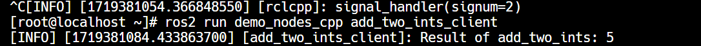

# openEuler
使用qemu来分别构建openEuler并且跑x86, arm, riscv下的ros包
--------------------------------------------

[任务](https://github.com/jiuyewxy/weloveinterns/issues/1)

[ref1](https://github.com/Pagerd/PLCT/blob/main/Report/week/week47/ROS-humble-oerv24.03-x86/README.md)

本稿在[trilium](https://github.com/zadam/trilium)上编写，之后将会同步到仓库[PLCT-report](https://github.com/Tabbleman/PLCT-report)上。

**Prerequest**:
---------------

> First of all: Don't panic!

前情提要你需要一台有电脑，其次你可以选择直接从软件源下载编译好的qemu-release，也可以像俺一样直接从源码编译，具体工作流如下：

```text-plain
wget https://download.qemu.org/qemu-9.0.1.tar.xz
tar xf qemu-9.0.1.tar.xz
cd qemu-9.0.1
sudo apt install libslirp-dev bison flex libcurses-ocaml-dev libglib2.0-dev python3-venv ninja-build
./configure --enable-kvm --enable-user --enable-sdl
make -j
sudo make install
```

如何使用qemu构建不同架构下面的openeuler
--------------------------

测试环境：

|     |     |
| --- | --- |
| 硬件信息 | 软件信息 |
| intel Eeon E5 2680v4 × 2 ~**28c56T**~  <br>Samsung RECC ddr4 4R × 4 2133MHz 32G × 2 = 64G  <br>Ati HD5450 | Platform kernel info：5.15.153.1-microsoft-standard-WSL2<br><br>qemu-9.0.1 `compile option: -enable-kvm`<br><br>openEuler各版本安装来源：<br><br>*   [x86](https://mirror.sjtu.edu.cn/openeuler/openEuler-24.03-LTS/virtual_machine_img/x86_64/openEuler-24.03-LTS-x86_64.qcow2.xz)<br>*   [aarch](https://mirror.sjtu.edu.cn/openeuler/openEuler-24.03-LTS/virtual_machine_img/aarch64/openEuler-24.03-LTS-aarch64.qcow2.xz)<br>*   [riscv64](https://mirror.sjtu.edu.cn/openeuler/openEuler-24.03-LTS/virtual_machine_img/riscv64/openEuler-24.03-LTS-riscv64.qcow2.xz) |

> TODO:
> 
> 完善makefile自动化工作流

* * *

### x86 平台下

> ~啊注意啊（敲黑板），本人在摸爬滚打的时候发现，你需要下载的并不是官网的iso文件，而是云计算平台下面对应的\*.qcow2文件~
> 
> ~也就是说，你需要下载的并不是iso文件，而是一个已经安装好操作系统的hda。~

按照前辈写好的命令，顺便写个Makefile方便后续处理，陆陆续续整理到[openEulerRunner](https://github.com/Tabbleman/openEulerRunner)上面，给自己和后来的人指北。

用户信息和密码：

*   `root`
*   openEuler12#$

  
ssh 的功能也正常，美滋滋。


接下来就是测试ros的各个功能.

TODO

注意：由于测试环境为wsl，桌面环境的安装会比较buggy，因此暂时跳过桌面环境的测试。之后会在ubuntu原生的系统上面测试。

#### Ros2测试

测试用例及其状况：

下载和安装ros

```text-plain
bash -c 'cat << EOF > /etc/yum.repos.d/ROS.repo
[openEulerROS-humble]
name=openEulerROS-humble
baseurl=http://121.36.84.172/dailybuild/EBS-openEuler-24.03-LTS/EBS-openEuler-24.03-LTS/EPOL/multi_version/ROS/humble/x86_64/
enabled=1
gpgcheck=0
EOF'

dnf install "ros-humble-*" --skip-broken --exclude=ros-humble-generate-parameter-library-
example
dnf update
```

|     |     |     |
| --- | --- | --- |
| 序号  | 测试用例名 | Status |
| 1   | 测试 turtlesim功能 | Failed |
| 2   | 测试ros2 pkg create | TODO |
| 3   | 测试ros2 pkg executables | TODO |
| 4   | 测试ros2 pkg list | TODO |
| 5   | 测试ros2 pkg prefix | TODO |
| 6   | 测试ros2 pkg xml | TODO |
| 7   | 测试ros2 run | TODO |
| 8   | 测试ros2 topic list | TODO |
| 9   | 测试ros2 topic info | TODO |
| 10  | 测试ros2 topic type | TODO |
| 11  | 测试ros2 topic find | TODO |
| 12  | 测试ros2 topic hz | TODO |
| 13  | 测试ros2 topic bw | TODO |
| 14  | 测试ros2 topic echo | TODO |
| 15  | 测试ros2 param 工具 | TODO |
| 16  | 测试ros2 service 工具 | TODO |
| 17  | 测试ros2 node list | TODO |
| 18  | 测试ros2 node info | TODO |
| 19  | 测试ros2 bag 工具 | TODO |
| 20  | 测试ros2 launch 工具 | TODO |
| 21  | 测试ros2 interface list | TODO |
| 22  | 测试ros2 interface package | TODO |
| 23  | 测试ros2 interface packages | TODO |
| 24  | 测试ros2 interface show | TODO |
| 25  | 测试ros2 interface proto | TODO |
| 26  | 测试 ros 通信组件相关功能 | TODO |

##### 测试 turtlesim功能（TODO）

无桌面环境，TODO

##### 测试ros2 pkg create  


##### 测试ros2 pkg executables  


##### 测试ros2 pkg list  


##### 测试ros2 pkg prefix  


##### 测试ros2 pkg xml  


##### 测试ros2 run  


##### 测试ros2 topic list  
  
 

##### 测试ros2 topic info  


##### 测试ros2 topic type  


##### 测试ros2 topic find  
  

##### 测试ros2 topic hz  


##### 测试ros2 topic bw  


##### 测试ros2 topic echo  


##### 测试ros2 param 工具  


##### 测试ros2 service 工具  


##### 测试ros2 node list  


##### 测试ros2 node info  


##### 测试ros2 bag 工具  
  


ros2 bag info   


ros2 bag replay   
  


##### 测试ros2 launch 工具  


##### 测试ros2 interface list

##### 测试ros2 interface package  
  


##### 测试ros2 interface packages  


#####   
测试ros2 interface show  
  
  
  


##### 测试ros2 interface proto  


##### 测试 ros 通信组件相关功能  
  


ros2 tf2\_ros  
  


ros2 view frame   
保存pdf  


### aarch平台下

> ~卡住了😭😭😭😭~
> 
> 成功了！！！！！🥰🥰🥰🥰
> 
> 自动化工作流整理到openEulerRunner里面了！

```text-plain
bash -c 'cat << EOF > /etc/yum.repos.d/ROS.repo
[openEulerROS-humble]
name=openEulerROS-humble
baseurl=http://121.36.84.172/dailybuild/EBS-openEuler-24.03-LTS/EBS-openEuler-24.03-LTS/EPOL/multi_version/ROS/humble/aarch64/
enabled=1
gpgcheck=0
EOF'

dnf install "ros-humble-*" --skip-broken --exclude=ros-humble-generate-parameter-library-
example
dnf update
```


#### Ros2 测试

|     |     |     |
| --- | --- | --- |
| 序号  | 测试用例名 | Status |
| 1   | 测试 turtlesim功能 | Failed |
| 2   | 测试ros2 pkg create | Passed |
| 3   | 测试ros2 pkg executables | Passed |
| 4   | 测试ros2 pkg list | Passed |
| 5   | 测试ros2 pkg prefix | Passed |
| 6   | 测试ros2 pkg xml | Passed |
| 7   | 测试ros2 run | Passed |
| 8   | 测试ros2 topic list | Passed |
| 9   | 测试ros2 topic info | Passed |
| 10  | 测试ros2 topic type | Passed |
| 11  | 测试ros2 topic find | Passed |
| 12  | 测试ros2 topic hz | Passed |
| 13  | 测试ros2 topic bw | Passed |
| 14  | 测试ros2 topic echo | Passed |
| 15  | 测试ros2 param 工具 | Passed |
| 16  | 测试ros2 service 工具 | Passed |
| 17  | 测试ros2 node list | Passed |
| 18  | 测试ros2 node info | Passed |
| 19  | 测试ros2 bag 工具 | Passed |
| 20  | 测试ros2 launch 工具 | Passed |
| 21  | 测试ros2 interface list | Passed |
| 22  | 测试ros2 interface package | Passed |
| 23  | 测试ros2 interface packages | Passed |
| 24  | 测试ros2 interface show | Passed |
| 25  | 测试ros2 interface proto | Passed |
| 26  | 测试 ros 通信组件相关功能 | Passed |

### riscv下

> ~还在尝试（~
> 
> 也成功了！